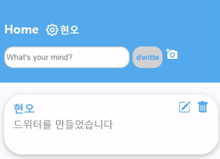
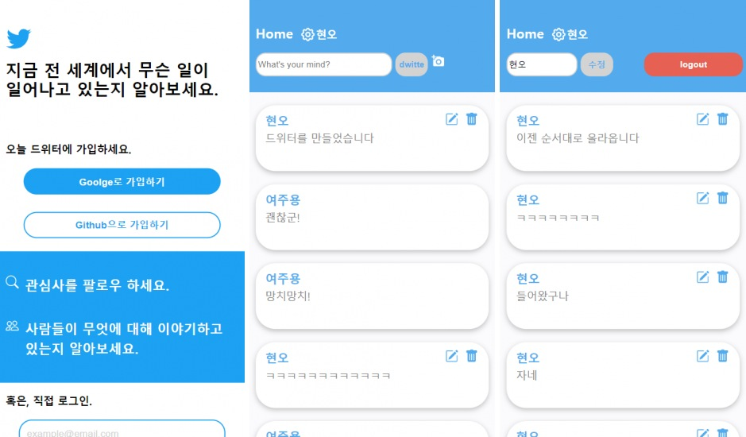

# Dwitter

Cloning Twitter with **React** and **Firebase**.

Try it now! https://soonitoon.github.io/dwitter (for mobile)

Visite my blog📰 https://han.gl/Aq78Q

## You can...

1. 'Dwitte' message💬 with attachment image.📸
2. Edit✍️ or delete your dwitte.
3. Edit your user name.💁
4. See friend's dwitte in real-time!🔥

## How to log in

- **Google** account
- **GitHub** account
- Make account with your **email address**

## Notice

- Due to security concerns, the social login feature may not work in some in-app browsers.

## Screeshots

## Requirement

### 1. Install npm

If you want to run this code on your computer, you need **npm**.

- Linux: `$ sudo apt-get install npm`
- Windows: visite https://nodejs.org/ko
- macOS: `$ brew install node`

### 2. Install npm modules

Run this command: `$ npm i`

### 3. Get env

You need env file containing keys to access Google Firebase services. Contect me: soonitoon@gmail.com

## License

**MIT**

## Supported browsers list

Here is supported browsers list now:

- [x] and_chr 92
- [x] and_uc 12.12
- [x] android 4.4.3-4.4.4
- [x] chrome 91
- [x] chrome 90
- [x] chrome 89
- [x] edge 91
- [x] firefox 89
- [x] firefox 88
- [x] ios_saf 14.5-14.7
- [x] ios_saf 14.0-14.4
- [x] ios_saf 13.4-13.7
- [x] opera 76
- [x] safari 14.1
- [x] safari 14
- [x] safari 13.1
- [x] samsung 14.0

## Change log

### v1.0.0

First version of dwitter!

release: https://github.com/soonitoon/dwitter/releases/tag/v1.0.0

### v1.0.1

Bug fix:

- Supported browsers list was changed.
- Issue that cannot delete no-image dwitte was fixed.
- Memory-leak issue was fixed.
- Some small bugs were fixed.

release: https://github.com/soonitoon/dwitter/releases/tag/v1.0.1

### v1.2.0

New feature:

- You can push Like👍 button on friend's post!

Bug fix:

- Some small bug fix
